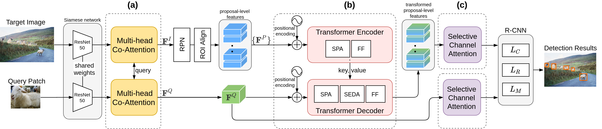

# Adaptive Image Transformer for One-Shot Object Detection
[Adaptive Image Transformer for One-Shot Object Detection](https://openaccess.thecvf.com/content/CVPR2021/papers/Chen_Adaptive_Image_Transformer_for_One-Shot_Object_Detection_CVPR_2021_paper.pdf)
By Ding-Jie Chen, He-Yen Hsieh, and Tyng-Luh Liu
IEEE Conference on Computer Vision and Pattern Recognition (IEEE CVPR), 2021.


## Introduction

One-shot object detection tackles a challenging task that aims at identifying within a target image all object instances of the same class, implied by a query image patch. The main difficulty lies in the situation that the class label of the query patch and its respective examples are not available in the training data. Our main idea leverages the concept of language translation to boost metric-learning-based detection methods. Specifically, we emulate the language translation process to adaptively translate the feature of each object proposal to better correlate the given query feature for discriminating the class-similarity among the proposal-query pairs. To this end, we propose the Adaptive Image Transformer (AIT) module that deploys an attention-based encoder-decoder architecture to simultaneously explore intra-coder and inter-coder (i.e., each proposal-query pair) attention. The adaptive nature of our design turns out to be flexible and effective in addressing the one-shot learning scenario. With the informative attention cues, the proposed model excels in predicting the class-similarity between the target image proposals and the query image patch. Though conceptually simple, our model significantly outperforms a state-of-the-art technique, improving the unseen-class object classification from 63.8 mAP and 22.0 AP50 to 72.2 mAP and 24.3 AP50 on the PASCAL-VOC and MS-COCO benchmark datasets, respectively.


## Implementation
### 1. Prerequisites
* Ubuntu 20.04.6
* Python 3.9
* Pytorch 1.7.1
* CUDA 10.1


### 2. Data Preparation
* Please follow [py-faster-rcnn](https://github.com/rbgirshick/py-faster-rcnn#beyond-the-demo-installation-for-training-and-testing-models) to prepare the data.


### 3. Pretrained Backbone
We utilized the ResNet50 backbone which was pretrained by excluding all COCO-related ImageNet classes. This was achieved by matching the WordNet synsets of ImageNet classes to COCO classes. The original dataset contained 1,284,168 images of 1000 classes. However, we retained only 933,052 images from the remaining 725 classes. The pretrained ResNet50 backbone can be accessed from the following source

* Pretrained ResNet50: [Google Drive from CoAE](https://drive.google.com/file/d/1SL9DDezW-neieqxWyNlheNefwgLanEoV/view?usp=sharing)

Download and unzip it into the ../data/


### 4. Reference Images
The images used as reference are obtained by taking out patches corresponding to the predicted bounding boxes of Mask R-CNN. The bounding boxes have to meet the conditions of IOU threshold > 0.5 and score confidence > 0.7. The reference images are available at

* Reference Images: [Google Drive from CoAE](https://drive.google.com/file/d/1O1AQtjozgpdtuETGE6X4UItpqcVPUiXH/view?usp=sharing)

Download and unzip them into the ../data/


### 5. Quick Start
```bash
  $ git clone https://github.com/CAIVIAC/AIT.git
  $ conda create --name ait python=3.9 -y
  $ conda activate ait
  $ pip install torch==1.7.1+cu101 torchvision==0.8.2+cu101 torchaudio==0.7.2 -f https://download.pytorch.org/whl/torch_stable.html
  $ cd AIT/
  $ pip install -r requirements.txt
  $ cd lib/
  $ python3 setup.py build develop
  # adding the environment variables
  $ export PATH=/usr/local/cuda-10.1/bin:$PATH
  $ export LD_LIBRARY_PATH=/usr/local/cuda-10.1/lib64:$LD_LIBRARY_PATH
  # to train/test a model with ResNet50 on VOC
  $ bash ./train_voc.sh
  $ bash ./test_voc.sh
  # to train/test a model with ResNet50 on COCO
  $ bash ./train_coco.sh
  $ bash ./test_coco.sh
``` 
#### Note
The coco dataset is divided into four groups for training and testing different categories. 
To adjust the categories, use "*--g*"(1~4). For other settings, use "*--g 0*".

If you want to train parts of the dataset, try to modify "*--seen*". 
* "*--seen 1*": session see train_categories(config file) class
* "*--seen 2*": session see test_categories(config file) class
* "*--seen 3*": session see train_categories + test_categories class

 

## Acknowledgments
Our code is based on [faster-rcnn](https://github.com/jwyang/faster-rcnn.pytorch) and [CoAE](https://github.com/timy90022/One-Shot-Object-Detection). We are grateful to them for releasing the code.

 

## Citation
```
@inproceedings{ChenHL21,
  author    = {Ding-Jie Chen and He-Yen Hsieh and Tyng-Luh Liu},
  title     = {Adaptive Image Transformer for One-Shot Object Detection},
  booktitle = {CVPR},
  pages     = {12247--12256},
  publisher = {Computer Vision Foundation / {IEEE}},
  year      = {2021}
}
```